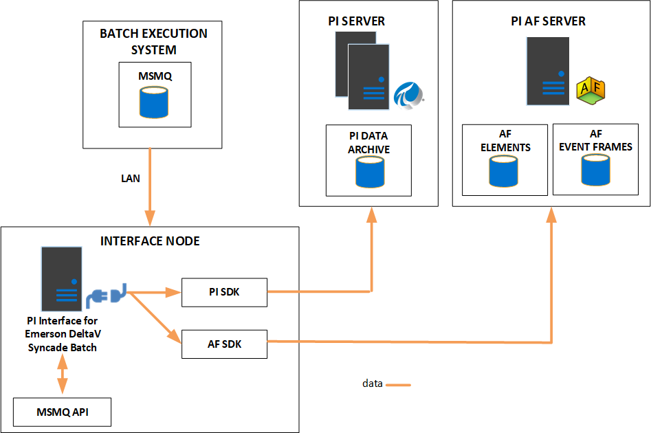
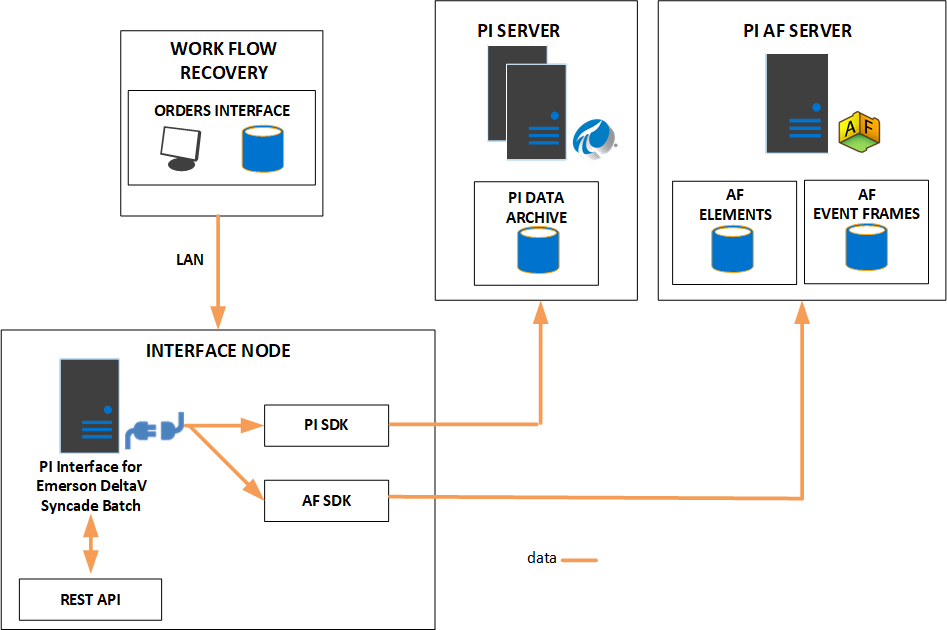

# Batch interface configuration

<!-- Interface-specific framework topic. Customize this topic for your interface. Remove the diagrams that don't apply -->

The following diagrams illustrate various options for configuring batch interfaces, depending on the data source and the desired PI System output. 

The first illustrates configuration for the Data Source MSMQ. 

**Data source: MSMG Target—PI AF (event frames and assets)**

This diagram illustrates configuration for recovery. 

**Data source: Workflow restful web service Target—PI AF (event frames and assets)**

