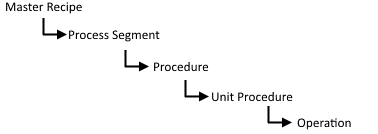

# Template placeholders

<!-- Mark Bishop 6/18/21: Customized for Emerson Syncade -->

The following sections list placeholders provided by PI Interface for Emerson Syncade Batch for defining template settings.

## Syncade Placeholders

The data source provides XML formatted messages that the interface reads. The placeholders describing the recipe hierarchy depend on the style of recipe. The following examples use terminology like: OrderInstanceSummary/@Name where @Name is the name attribute on the OrderInstanceSummary XML element.

In this release the supported batch hierarchical levels are:

The following tables illustrate Placeholders for "Master Recipe", "Process Segment", "Procedure", and "Unit Procedure" recipe styles:

| Placeholder | Master Recipe-style recipe |
|:-|:-|
| [MASTERRECIPE] | `OrderInstanceSummary/@Name` |
| [PROCESSSEGMENT] | `OrderInstanceSummary/ItemInstanceSummary/@Name` |
| [PROCEDURE] | `OrderInstanceSummary/ItemInstanceSummary/ItemInstanceSummary/@Name` |
| [UNITPROCEDURE] | `OrderInstanceSummary/ItemInstanceSummary/ItemInstanceSummary/ItemInstanceSummary/@Name` |
| [OPERATION] | `OrderInstanceSummary/ItemInstanceSummary/ItemInstanceSummary/ItemInstanceSummary/ItemInstanceSummary/@Name`  In this example, the name of the fifth level down in the recipe |

| Placeholder | Process Segment-style recipe |
|:-|:-|
| [PROCESSSEGMENT] | `OrderInstanceSummary/@Name` |
| [PROCEDURE] | `OrderInstanceSummary/ItemInstanceSummary/@Name` |
| [UNITPROCEDURE] | `OrderInstanceSummary/ItemInstanceSummary/ItemInstanceSummary/@Name` |
| [OPERATION] | `OrderInstanceSummary/ItemInstanceSummary/ItemInstanceSummary/ItemInstanceSummary/@Name`  In this example, the name of the fourth level down in the recipe. |

| Placeholder | Procedure-style recipe |
|:-|:-|
| [PROCEDURE] | `OrderInstanceSummary/@Name` |
| [UNITPROCEDURE] | `OrderInstanceSummary/ItemInstanceSummary/@Name` |
| [OPERATION] | `OrderInstanceSummary/ItemInstanceSummary/ItemInstanceSummary/@Name`  In this example, the name of the third level down in the recipe. |

| Placeholder | Unit Procedure-style recipe |
|:-|:-|
| [UNITPROCEDURE] | `OrderInstanceSummary/@Name` |
| [OPERATION] | `OrderInstanceSummary/ItemInstanceSummary/@Name`  In this example, the name of the second level down in the recipe. |

Placeholders that vary depending on whether the event occurs at the start or end of a step in the recipe:

| Placeholder | Event at start of step | Event at end of step |
|:-|:-|:-|
| [TIME] | `InstructionParameterInstance/@ActionDateTime` for instruction parameters.  or  `OrderInstanceSummary/@StartDateTime` or `ItemInstanceSummary/@StartDateTime` for events. | `OrderInstanceSummary/@EndDateTime`  or  `ItemInstanceSummary/@EndDateTime` for events. |
| [TIMESTAMP] | `InstructionParameterInstance/@ActionDateTime` for instruction parameters.  or  `OrderInstanceSummary/@StartDateTime` or `ItemInstanceSummary/@StartDateTime` for events. | `OrderInstanceSummary/@EndDateTime`  or  `ItemInstanceSummary/@EndDateTime` for events. |

Placeholders for events that do not depend on recipe style or temporal relationship to step:

| Placeholder | Example |
|:-|:-|
| [AREA] | `constant string "AREA_CS"` |
| [BATCHID] | `OrderInstanceSummary/@OrderNumber` |
| [DESCRIPT] | `InstructionParameter/@Description` |
| [HIGH] | `InstructionParameterInstance/@High` |
| [LOW] | `InstructionParameterInstance/@Low` |
| [PARAMETER] | `InstructionParameter/@Name` |
| [PHASE] | `InstructionParameter/@Name` |
| [PROCESSCELL] | `constant string "PROCESSCELL_CS"` |
| [PVAL] | `InstructionParameterInstance/@CV` |
| [SET] | `InstructionParameterInstance/@Set` |
| [UNIQUEID] | `OrderInstanceSummary/@OrderNumber` |
| [UNIT] | `ItemInstanceSummary/@ActualUnitName` |
| [VALUE] | `InstructionParameterInstance/@CV` |
