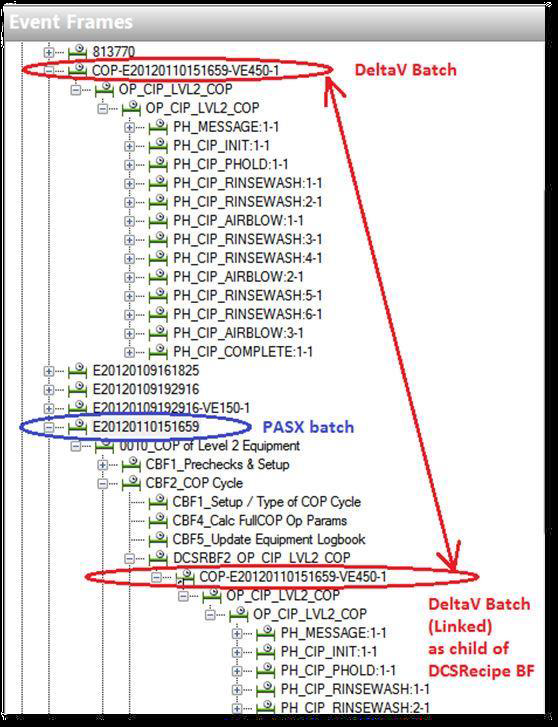

# Linking BES to MES batches using event frames

<!-- Customized for Emerson Syncade -->

To consolidate the output of a Emerson Syncade system and a batch execution system (BES), specify the linking element as follows:

1. Open PI Event Frames Interface Manager.

2. Click the **Batch Setup** tab.

3. For Emerson Syncade interfaces, enable the **Link to child event frames** option, and specify the path to the PI AF element.

4. For BES interfaces, enable the **Link from parent event frames** option, and specify the path to the same PI AF element.

This configuration is typical in an environment where an Emerson Syncade system supervises multiple batch execution systems to manufacture a single product. For each BES, configure a dedicated interface instance and specify the same PI AF linking element. When an event frame created by the Emerson Syncade interface references the creation of a batch in the BES, a reference is made to the Emerson Syncade event frame in the linking element. Then, when the BES interface creates its event frame, a reference to it is created in the Emerson Syncade event frame, creating a consolidated view of all the related events from different systems.

*Note -- Event Frame linking is not supported with Syncade Work Flow 4.9 as the 'AutomationBatchID' attribute does not exist at the OrderInstanceSummary level. 

For example, the following figure illustrates an event frame created based on a batch from an Emerson DeltaV batch execution system. This event frame is referenced in an event frame created by a Werum PAS-X MES. Other batch interface instances that are configured to use the same linking element create references to their batches under the same link.



The .ini file code for creating those event frames looks like this example:

```text
HOST=jshearouse5520
PS=EMDVBCS
ID=998
AFHOST=jshearouse5520
AFDATABASE=EMDVBCS
DB=2
Source[1].msmqpath=jshearouse5520\private$\historian2
Source[1].websrvpath=example.com
WRITELINK=\\LINKPARENT\LINKTEST
```
