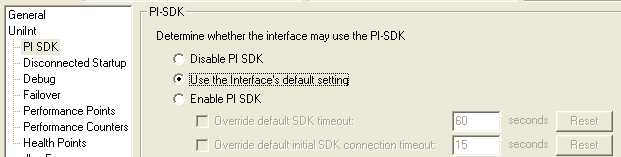

# PI SDK options

To access the PI SDK settings for this interface, select this interface from the Interface list and click **UniInt - PI SDK** in the Parameter Category pane.

## Disable PI SDK

Select this option to set the interface not to use the PI SDK. The command line equivalent for this option is /PISDK=0.

## Use the Interface's default setting

This option does not determine whether the interface uses the PI SDK.

## Enable PI SDK

Select this option to set the interface to use the PI SDK. Choose this option if the PI Data Archive version is earlier than 3.4.370.x or the PI API is earlier than 1.6.0.2, and you want to use extended lengths for the Tag, Descriptor, ExDesc, InstrumentTag, or PointSource point attributes. The maximum lengths for these attributes are:

| Attribute | Enable the Interface to use the PI SDK | PI Data Archive earlier than 3.4.370.x or PI API earlier than 1.6.0.2, without the use of the PI SDK |
|--|--|--|
| Tag | 1023 | 255 |
| ExDesc | 1023 | 80 |
| InstrumentTag | 1023 | 32 |
| PointSource | 1023 | 1 |
