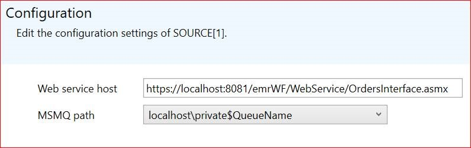

# Data sources

<!-- Mark Bishop 6/18/21: Customized for Emerson Syncade -->

PI Interface for Emerson Syncade Batch collects data historically from Syncade web services 
and real-time data from the Microsoft Message Queue (MSMQ).

To configure the interface to collect historical data from a Syncade web service, specify the hostname of the Syncadeweb service host on the **Source** tab of the PI Event Frame Interface Configuration Manager as a URL. For example:

`https://MySyncadeHost.int:8081/emrWF/WebService/OrdersInterface.asmx`
    
**Note:** You only need to specify the complete URL.

To configure the interface to collect real-time data from the Microsoft Message Queue, ensure that the Syncade system is configured to write data to a message queue on the interface machine and, on the **Source** tab of the PI Event Frame Interface Configuration Manager, select that message queue.



```text
SOURCE[1].msmqpath=localhost\private$\Q<name>
Source[1].websrvpath=https://localhost:8081/emrWF/WebService/OrdersInterface.asmx
```
